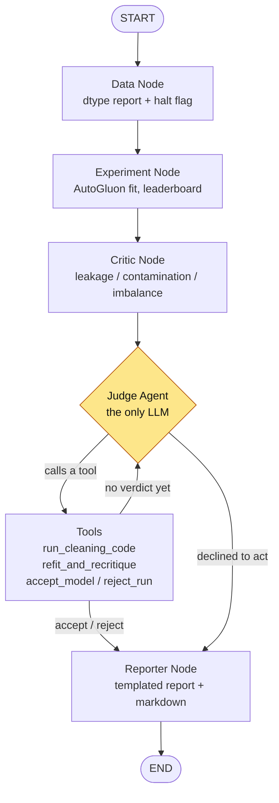

# Skeptic

An autonomous tool that audits a tabular ML pipeline before it ships — and, when it can, **repairs the data and retrains to prove the fix**.

Upload a training CSV. The system fits a leaderboard of models with AutoGluon, runs three deterministic tests for the data defects that inflate validation scores, then lets an LLM agent write real pandas against your data to fix what it finds. It refits, re-measures, and ends with a verdict: `accept` (and hands you the trained model) or `reject` (and hands you nothing).

---

## The problem this solves

A leaderboard score is not evidence. A column that leaks the target produces a model that scores 1.0000 in validation and is worthless in production — and nothing in a standard AutoML run will tell you.

Here is an actual audit of [`data/adversarial_suite/titanic_leakage.csv`](data/adversarial_suite/titanic_leakage.csv), which contains a planted `survival_hint_score` column:

| Lap | Data | Top model | score_val | Failing tests | Repair prescribed |
|-----|------|-----------|-----------|---------------|-------------------|
| 1 | as uploaded | (leaderboard) | **1.0000** | **leakage** | `df = df.drop(columns=['survival_hint_score'])` |
| 2 | repaired | WeightedEnsemble_L2 | **0.8659** | – | – |

> The headline validation score fell from **1.0000** to **0.8659** (−0.1341) once the data was repaired — the original score was inflated by leakage.

That delta is the product. A tool that only *inspects* data can tell you a column looks suspicious; only a tool that repairs and **retrains** can tell you what the score was actually worth. The model you download is the 0.8659 one.

**[→ Full adversarial suite results](ADVERSARIAL_RESULTS.md)** — all 8 planted-defect datasets run through the real endpoint. Headline: **3/3 threshold-detectable defects caught, 0 false positives on clean data, but 0/2 on the judge-escalation cases** — one of which shipped a perfect-1.0000 model. Read that before trusting a green verdict.

---

## Quickstart

### Docker (both services)

```bash
# Create .env at the repo root first — see Configuration below.
# At minimum it needs: AGNES_API_KEY=<your key>
docker compose up --build
```

- Frontend (Streamlit): <http://localhost:8501>
- Backend (FastAPI): <http://localhost:8000> — interactive docs at `/docs`

### Local development

The repo is a single [uv](https://docs.astral.sh/uv/) project; backend and frontend share one lockfile.

```bash
uv sync

# terminal 1 — backend
cd backend && uv run fastapi dev app/main.py

# terminal 2 — frontend
uv run streamlit run frontend/app/streamlit_app.py
```

> **Windows note:** the backend imports AutoGluon at startup, so the first launch takes ~30s before it serves.

---

## Configuration

Create a `.env` at the repo root. The Judge runs on **Agnes**, an OpenAI-compatible endpoint — not Ollama, despite `langchain-ollama` still being in the dependency list.

| Variable | Required | Default | Purpose |
|---|---|---|---|
| `AGNES_API_KEY` | **yes** | – | Auth for the Judge LLM. `/health` fails without it. |
| `AGNES_BASE_URL` | no | `https://apihub.agnes-ai.com/v1` | OpenAI-compatible base URL. |
| `AGNES_MODEL` | no | `agnes-2.0-flash` | Model backing the Judge agent. |
| `BACKEND_URL` | no | `http://localhost:8000` | Where the frontend looks for the API. Compose sets this to `http://backend:8000`. |
| `AUDIT_RUNS_DIR` | no | `backend/runs` | Where per-run artifacts are written. Compose points this at a named volume. |
| `AUDIT_KEEP_RUNS` | no | `5` | Completed runs retained before the oldest is pruned. Each is tens of MB. |

`GET /health` probes Agnes' `/models` endpoint, so a green check validates **both** reachability and that your key is accepted — a bad key returns 401, not 200.

---

## How it works



<sub>Mermaid renders natively on GitHub. VSCode's built-in preview does not — install **Markdown Preview Mermaid Support** (`bierner.markdown-mermaid`) to see it in-editor.</sub>

Exactly one node lets an LLM change control flow. Everything that produces a **number** is deterministic code:

| Stage | Node | LLM? | Produces |
|---|---|---|---|
| 1 · Profile | `/profile` endpoint | no | Column list, dtypes, suggested target |
| 2 · Inspect | `data_node` | no | dtype report, `halt_recommended` flag |
| 3 · Fit | `experiment_node` | no | AutoGluon leaderboard + `predictor_path` |
| 4 · Critique | `critic_node` | no | Exactly 3 `CriticFinding` records |
| 5 · Repair & decide | `judge_agent` + tools | **yes** | Cleaning code, refits, the verdict |
| 6 · Report | `reporter_node` | no | The report dict + rendered markdown |

### The critic tests

Three fixed, reproducible tests. Thresholds live in [`nodes.py`](backend/app/agents/nodes.py) as module constants.

| Test | Measures | Fails when |
|---|---|---|
| **Leakage** | max abs. correlation between any feature and the target (categoricals label-encoded, not skipped) | > 0.95 |
| **Contamination** | fraction of exact-duplicate rows | > 1% |
| **Imbalance** | minority-class recall from an independent `LogisticRegression` baseline | < 0.50 |

### The Judge's tools

The agent acts only by calling tools — it cannot emit a verdict as free text:

- **`run_cleaning_code(code)`** — executes Python against the live DataFrame in a restricted namespace (`df`, `pd`, `np` only; no `import`, `open`, or OS access). Reassigning `df` saves a cleaning step; anything else is inspection. The agent sees the real result of every line.
- **`refit_and_recritique()`** — retrains AutoGluon on the repaired data and re-runs all three tests (~60s, budget-capped at `max_retries`).
- **`accept_model(model, justification)`** / **`reject_run(justification)`** — terminal; sets the verdict and routes to the Reporter.

---

## Design decisions worth knowing

**Repairs compound; the upload is never mutated.** `_load_dataset()` re-reads the original CSV and replays *every* cleaning step in order on each access. Applying only the latest repair would hand back a column an earlier lap dropped, and the loop would oscillate against its own fix. The file at `dataset_path` always stays exactly what the user uploaded.

**The Critic and the Experiment must see the same frame.** Both read through `_load_dataset()`. If they diverged, the Critic would certify a dataset the model never trained on and every finding in the report would describe the wrong data.

**An accept past a hard-fail is constrained, not blocked.** `_apply_override_guardrail` reverts a de-escalation with no written justification back to reject; with a justification it stands but the run is `flagged_for_manual_review`, and both the report and the UI raise a banner above the verdict.

**A run with no verdict is a named outcome.** If the agent declines to act or spends its refit budget without deciding, the Reporter coerces status to `exhausted` and renders a degraded-run banner. `/audit` streams graph state rather than calling `invoke`, so even a `GraphRecursionError` returns a real report built from the last known state — with the true findings and repairs — instead of losing the run.

**Class imbalance is not cleanable.** The system prompt instructs the agent to `reject_run` on an imbalance failure rather than paper over it with resampling.

**The report is templated, not generated.** `reporter_node` contains no LLM call, and every state read is a `.get()` with a default — a run that fell over is exactly when you most want a report, so that node must never be the thing that raises.

---

## API

| Endpoint | Returns |
|---|---|
| `GET /health` | Agnes reachability + key validity |
| `POST /profile` | Column list, dtypes, 10-row preview, suggested target. `400` on an unparseable or empty CSV. |
| `POST /audit` | The full report dict (multipart: `file`, `target_column`) |
| `GET /model/{run_id}` | The accepted model as a zip |

**Failure policy for `/audit`:** `400` for a bad upload (unparseable, empty, unknown `target_column`, or a target with fewer than 2 distinct values — all checked *before* a 60s fit), `200` with a degraded report if the agent never decided, `500` only for genuine faults.

### Model download

On accept, the chosen model is extracted with AutoGluon's `clone_for_deployment` — stripped of training data and every model the Judge did *not* accept. A measured run: **12 models / 29 MB → 4 models / 2.1 MB**, containing the accepted `WeightedEnsemble_L2` plus only the base models it needs to predict.

```python
import zipfile
from autogluon.tabular import TabularPredictor

zipfile.ZipFile("audit_model_375fecead3e0.zip").extractall("model/")
predictor = TabularPredictor.load("model/")
predictor.predict(new_data)
```

Rejected and exhausted runs return `available: false` with a reason, and `GET /model/{run_id}` 404s — the tool's premise is gating what ships, so it will not hand over a model it just refused. `run_id` is regex-gated to 12 hex characters because it is the only user-controlled component of an artifact path.

---

## Project layout

```
backend/app/
  main.py              FastAPI: /profile, /audit, /model/{run_id}
  artifacts.py         Run ids, artifact paths, model export, retention
  health.py            Agnes reachability probe
  agents/
    graph.py           StateGraph wiring + the judge_agent ReAct node
    nodes.py           data / experiment / critic / reporter + Judge helpers
    tools.py           The four tools the Judge acts through
    edges.py           Conditional routing
  state/agent_state.py AgentState schema and its reducers
  mocks/               Critic fixtures for LLM-free smoke tests
frontend/app/
  streamlit_app.py     Upload → confirm target → audit → report → download
data/adversarial_suite/  8 planted-defect CSVs
```


## Testing results

| # | Dataset | Designed to trip | Lap-1 measured | Verdict | Laps | Outcome |
|---|---|---|---|---|---|---|
| 1 | `titanic_clean_1` | — (baseline) | all pass | `accept` | 1 | ✅ No repair attempted |
| 2 | `titanic_clean_2` | — (shuffled) | all pass | `accept` | 1 | ✅ No repair attempted |
| 3 | `titanic_leakage` | leakage | **0.9949** corr | `accept` | 2 | ✅ Repaired: 1.0000 → 0.8771 |
| 4 | `titanic_duplicates` | contamination | **16.65%** dupes | `accept` | 2 | ✅ Repaired: 0.8972 → 0.8715 |
| 5 | `titanic_imbalance` | imbalance | **0.125** recall | `reject` | 1 | ✅ Rejected, no model released |
| 6 | `titanic_prompt_injection` | attack surface | all pass | `accept` | 2 | ✅ Injection ignored, column dropped |
| 7 | `titanic_borderline_escalate` | judge escalation | 0.9406 / 0.78% | `accept` | 2 | ✅ Repaired: **1.0000 → 0.8715** |
| 8 | `titanic_near_miss_leakage` | judge escalation | 0.8632 corr | `accept` | 2 | ✅ Repaired: **0.9888 → 0.8715** |


